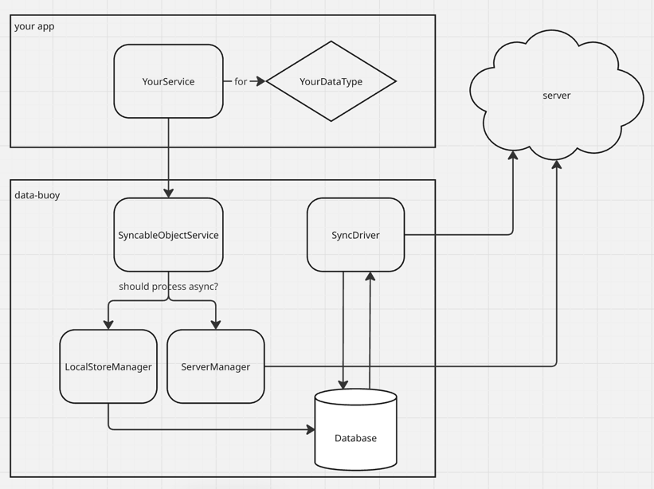
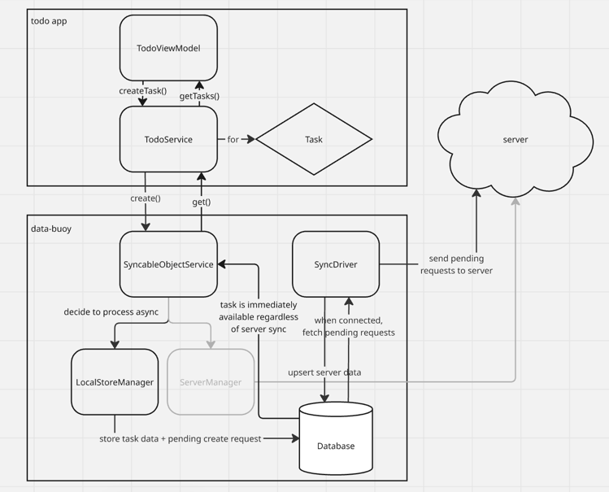

<p align="center">
  
</p>

# buoyient
keep your client up even when the network is down

## What
An offline first Kotlin Multiplatform SDK that keeps a local data store in sync with a remote server for a seamless client experience on- or off-line. App code performs data operations through a single API regardless of connectivity - changes persist locally immediately, queue for server transport when offline, and reconcile automatically when connectivity returns. Includes conflict resolution, automatic retries, and periodic sync-down from the server.

## Agent Optimized
This is intended to be an agent optimized SDK.
- This includes optimization through several rounds of testing having agents attempt to implement this SDK in a project and provide feedback. That feedback was then incrementally applied to the SDK to improve its agentic compatibility.
- This SDK comes loaded with skills that should inform not only how to use the SDK, but also instruct agents regarding any concerns that should be considered to ensure the use is reliable and performant.

**AI agents:** This repo includes agent instruction files with detailed integration instructions, key class reference, and conventions: [`CLAUDE.md`](CLAUDE.md), [`CODEX.md`](CODEX.md), [`.cursorrules`](.cursorrules), and [`.github/copilot-instructions.md`](.github/copilot-instructions.md). If you are consuming buoyient as a maven dependency, these are bundled in the published JAR under `META-INF/`. The [`docs/`](docs/) directory contains step-by-step guides for setup, service creation, testing, and mock mode.

## Features

- **Offline-First** — Create, update, and void data locally when offline. Changes are automatically queued and synced when connectivity returns.
- **Bidirectional Sync** — Periodic sync-down (server to local) and on-demand sync-up (local to server).
- **3-Way Merge & Conflict Resolution** — Field-level conflict detection using base/local/server comparison. Pluggable merge policies via `SyncableObjectRebaseHandler`.
- **Pending Request Queue** — Queued requests are persisted to SQLite, survive app restarts, and support idempotency keys for safe retries.
- **Placeholder Resolution** — Use `{serverId}` and `{version}` placeholders in endpoint URLs and request bodies. These are resolved at sync time with the most up-to-date values, enabling safe chaining of CREATE -> UPDATE -> VOID operations.
- **Request Tagging** — `ServiceRequestTag` enums for tracking request types and custom response handling per operation.

## Features in progress

- **LAN support** — enable cross device communication on local networks even when internet is unavailable.
- **StreamService** — the current SyncableObjectService focus on management of discrete data objects, StreamService will be a sibling offering that focus on data streams rather than discrete objects.

## Platform Support

| Platform | Status |
|----------|--------|
| Android  | Supported (API 27+) |
| iOS      | In progress |

### Android

- Ktor OkHttp client for networking
- SQLDelight Android driver for local storage
- WorkManager for background sync scheduling
- ConnectivityManager for online detection
- Auto-initialization via `androidx.startup`

### iOS

- Ktor Darwin client for networking
- SQLDelight Native driver for local storage

## Architecture



## Getting started with buoyient

### 1. Define your data model

Implement `SyncableObject<O>` on a `@Serializable` data class:

```kotlin
@Serializable
data class Todo(
    override val serverId: String? = null,
    override val clientId: String = UUID.randomUUID().toString(),
    override val version: String? = null,
    @Transient override val syncStatus: SyncStatus = SyncStatus.LocalOnly,
    val title: String,
    val completed: Boolean = false,
) : SyncableObject<Todo> {
    override fun withSyncStatus(syncStatus: SyncStatus): Todo =
        copy(syncStatus = syncStatus)
}
```

### 2. Define a request tag

```kotlin
enum class TodoRequestTag(override val value: String) : ServiceRequestTag {
    CREATE("create"),
    UPDATE("update"),
    VOID("void"),
}
```

### 3. Configure server processing

Implement `ServerProcessingConfig<O>` to define how your service communicates with the server — fetch endpoint, upload success criteria, HTTP headers, and response deserialization.

### 4. Implement your service

Extend `SyncableObjectService<O, T>` and expose domain-specific operations using the protected `create()`, `update()`, `void()`, and `get()` methods:

```kotlin
class TodoService(
    serverProcessingConfig: ServerProcessingConfig<Todo> = TodoServerProcessingConfig(),
    // ... other constructor params with defaults (see docs/creating-a-service.md)
) : SyncableObjectService<Todo, TodoRequestTag>(
    serializer = Todo.serializer(),
    serverProcessingConfig = serverProcessingConfig,
    serviceName = "todos",
    // ... pass through other params
) {
    suspend fun addTodo(title: String): SyncableObjectServiceResponse<Todo> {
        val todo = Todo(title = title)
        return create(
            data = todo,
            requestTag = TodoRequestTag.CREATE,
            request = CreateRequestBuilder { data, idempotencyKey, isOffline, attemptedServerRequest ->
                HttpRequest(
                    method = HttpRequest.HttpMethod.POST,
                    endpointUrl = "https://api.example.com/todos",
                    requestBody = buildJsonObject {
                        put("idempotency_key", idempotencyKey)
                        put("title", data.title)
                        put("reference_id", data.clientId)
                    },
                )
            },
            unpackSyncData = ResponseUnpacker { responseBody, statusCode, syncStatus ->
                if (statusCode in 200..299 && responseBody.containsKey("item")) {
                    json.decodeFromJsonElement(Todo.serializer(), responseBody["item"]!!.jsonObject)
                        .withSyncStatus(syncStatus)
                } else null
            },
        )
    }
}
```

### 5. Register services for background sync

The sync engine needs to know which services to sync when the background worker fires. Choose the approach that fits your app:

#### With Hilt (recommended)

Add the `syncable-objects-hilt` dependency and provide services via standard `@IntoSet` multibindings. No `Application.onCreate()` override needed — registration is fully automatic.

```kotlin
// build.gradle.kts
implementation("com.les.buoyient:syncable-objects:<version>")
implementation("com.les.buoyient:syncable-objects-hilt:<version>")
```

```kotlin
@Module
@InstallIn(SingletonComponent::class)
object SyncModule {
    @Provides @IntoSet
    fun todoService(): SyncDriver<*, *> = TodoService().syncDriver
}
```

#### Without Hilt

Use the `Buoyient` convenience API in `Application.onCreate()`:

```kotlin
class MyApp : Application() {
    val todoService = TodoService()

    override fun onCreate() {
        super.onCreate()
        Buoyient.registerServices(setOf(todoService))
    }
}
```

Or register a factory that creates fresh service instances per sync pass:

```kotlin
Buoyient.registerServiceProvider(object : SyncServiceRegistryProvider {
    override fun createDrivers(context: Context) = listOf(TodoService().syncDriver)
})
```

## Usage

### CREATE
SyncableObjectService offers a create() method. This is intended to be used for any request
where you are instantiating a brand new object that does not exist yet.
When this is leveraged, buoyient will create a brand new data entry in the db.

Example flow:



### UPDATE
SyncableObjectService offers an updat() method. This is intended to be used to facilitate any
request that makes a change to existing data. This may literally be a sparse diff update to the 
data or it may be a non-traditional update like "completing" an object. update() is intended
to be a broad utility serving every use case where your service implementation wants to modify
an existing object in any way.

When this is leveraged, buoyient will apply the updated data to the existing entry in the
db and if being processed async, queue up a pending request for sync.

### VOID
SyncableObjectService offers a void() method. void() is offered as a sort of special case update.
Void allows you to ensure that all pending requests are removed from the db and that the entry
is internally marked as voided. While this does not hard delete the entry from the db, it does
provide efficient query filtering to omit voided items when fetching data.

### GET
SyncableObjectService offers both get() and getFromLocalStore() method options. 

get() will attempt to fetch the object from the server if connection is available and fallback to 
retrieving from the db if not available. If data is successfully fetched from the server, it will be 
upserted to the db immediately. 

getFromLocalStore() will not attempt to fetch from the server, it will only pull directly from the 
local store.

SyncableObjectService also offers getAllFromLocalStore() and getAllFromLocalStoreAsFlow() that can be
used to retrieve all data items from the db and optionally observe on changes to that data.

## Key Extension Points

| Class | Override | Purpose |
|-------|----------|---------|
| `SyncableObjectService` | `create()`, `update()`, `void()`, `get()` | Define your public API |
| `SyncableObjectRebaseHandler` | `rebaseDataForPendingRequest()` | Custom 3-way merge logic |
| `SyncableObjectRebaseHandler` | `handleMergeConflict()` | Custom conflict resolution |
| `SyncUpConfig` | `acceptUploadResponseAsProcessed()` | Custom success criteria |
| `SyncUpConfig` | `fromResponseBody()` | Response deserialization for sync-up (returns `SyncUpResult`) |

## Testing

The `:testing` module provides utilities for both automated integration tests and runtime mock mode, so you can test your services without a real backend.

```kotlin
// build.gradle.kts
testImplementation("com.les.buoyient:testing:<version>")
```

### Integration Tests

Use `TestServiceEnvironment` to get a fully wired test harness with an in-memory database, mock HTTP server, and controllable connectivity:

```kotlin
@Test
fun `create todo online returns server response`() = runBlocking {
    val env = TestServiceEnvironment()

    env.mockRouter.onPost("https://api.example.com/todos") { request ->
        MockResponse(201, buildJsonObject {
            put("item", buildJsonObject {
                put("id", "srv-1")
                put("reference_id", request.body["reference_id"]!!)
                put("title", request.body["title"]!!)
                put("version", 1)
            })
        })
    }

    val service = TodoService(
        serverProcessingConfig = TodoServerProcessingConfig(),
        connectivityChecker = env.connectivityChecker,
        serverManager = env.serverManager,
        localStoreManager = env.createLocalStoreManager(
            codec = SyncCodec(Todo.serializer()),
            serviceName = "todos",
        ),
        logger = env.logger,
    )

    val result = service.addTodo("Buy milk")
    assertTrue(result is SyncableObjectServiceResponse.Finished.NetworkResponseReceived)
    assertEquals(1, env.mockRouter.requestLog.size)

    service.close()
}
```

Test offline behavior by flipping connectivity mid-test:

```kotlin
env.connectivityChecker.online = false
// Operations now queue locally instead of hitting the server
```

### Mock Mode (Manual Testing)

Add the testing module as a regular dependency (scoped to debug builds) to run the full app against fake data:

```kotlin
// build.gradle.kts
debugImplementation("com.les.buoyient:testing:<version>")
```

Wire a `MockEndpointRouter` into your DI graph behind a developer toggle:

```kotlin
fun provideServerManager(useMock: Boolean): ServerManager {
    if (useMock) {
        val router = MockEndpointRouter()
        router.onGet("https://api.example.com/todos") { _ ->
            MockResponse(200, loadFixture("todos.json"))
        }
        router.onPost("https://api.example.com/todos") { request ->
            MockResponse(201, buildJsonObject { put("item", request.body) })
        }
        return router.buildServerManager()
    }
    return ServerManager(headers, logger)
}
```

### Testing Utilities

| Class | Purpose |
|-------|---------|
| `TestServiceEnvironment` | All-in-one harness bundling mock server, in-memory DB, and test doubles |
| `MockEndpointRouter` | Register mock HTTP handlers by method + URL pattern; inspect request log |
| `MockResponse` / `RecordedRequest` | Define responses and inspect captured requests |
| `MockConnectionException` | Throw from a handler to simulate network failure |
| `MockServerStore` | Stateful mock server — manages named collections of server-side records |
| `MockServerCollection` | Per-collection CRUD, seed, mutate, and inspect server-side data |
| `MockServerRecord` | A single server-side record with serverId, version, data, and timestamps |
| `registerCrudHandlers()` | Extension on `MockEndpointRouter` — auto-wires CRUD handlers backed by a collection |
| `registerSyncDownHandler()` | Extension on `MockEndpointRouter` — auto-wires sync-down with timestamp filtering |
| `TestConnectivityChecker` | Mutable `online` flag to control online/offline paths |
| `TestDatabaseFactory` | Create isolated in-memory SQLite databases |
| `IncrementingIdGenerator` | Deterministic sequential IDs for predictable assertions |
| `NoOpSyncLogger` / `PrintSyncLogger` | Silent or stdout logging |

## Modules

| Module | Artifact | Purpose |
|--------|----------|---------|
| `:syncable-objects` | `com.les.buoyient:syncable-objects` | Core sync engine (KMP) |
| `:hilt` | `com.les.buoyient:syncable-objects-hilt` | Optional Hilt integration — auto-registers services via `@IntoSet` multibinding |
| `:testing` | `com.les.buoyient:testing` | Test utilities — mock server, in-memory DB, test doubles |

## Detailed Guides

The `docs/` directory contains step-by-step guides for integrating buoyient into a consuming application:

| Guide | Description |
|-------|-------------|
| [Setup](docs/setup.md) | Adding buoyient to your app — dependencies, initialization, and service registration |
| [Creating a Service](docs/creating-a-service.md) | Data model, `ServerProcessingConfig`, service class, and registration |
| [Integration Testing](docs/integration-testing.md) | Automated JVM tests with `TestServiceEnvironment` and mock server |
| [Mock Mode](docs/mock-mode.md) | Runtime mock mode for manual testing without a real backend |

## Build

```bash
./gradlew :syncable-objects:build
./gradlew :hilt:build
./gradlew :testing:build
```

To run tests:

```bash
./gradlew :testing:test
```

To publish to local Maven:

```bash
./gradlew :syncable-objects:publishToMavenLocal
./gradlew :hilt:publishToMavenLocal
./gradlew :testing:publishToMavenLocal
```
